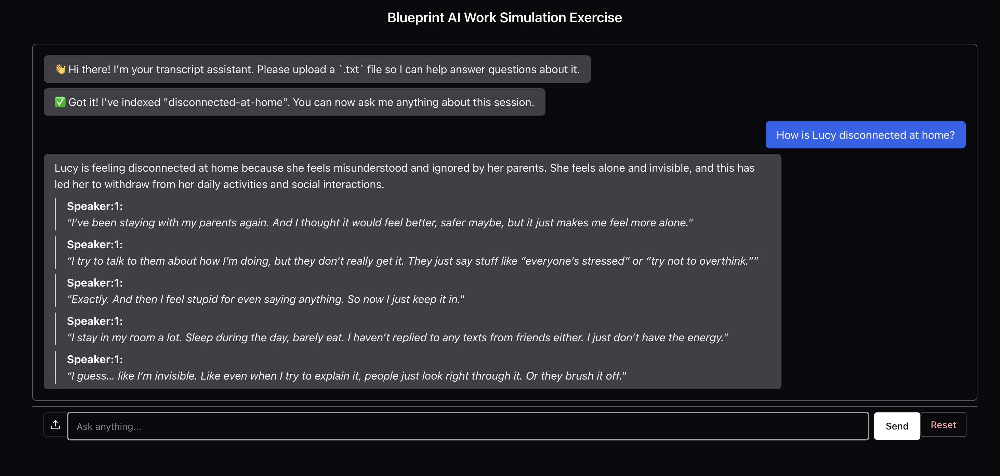
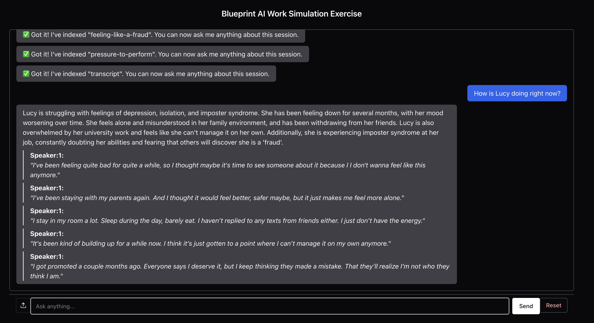

# Blueprint AI Work Simulation Exercise

This repository contains a full-stack application scaffold for a work simulation exercise. The goal is to evaluate your ability to work with AI technologies and build a simple question-answering agent.

## Project Overview

The project consists of:
- A React frontend (`client`)
- A NestJS backend (`api`)
- A PostgreSQL database
- A sample transcript for the AI agent to analyze

## Getting Started

1. Clone this repository
2. From the root of the project, start the application:
   ```bash
   docker compose up --build
   ```
3. In a new terminal, run the database migrations:
   ```bash
   docker compose run api npm run migration:up
   ```
4. Visit [localhost:5173](http://localhost:5173) to verify the application is running

> **🔑 Note**  
> You'll need to set an `OPENAI_API_KEY` in your environment for the backend to function properly.  
>  
> You can do this by creating a `.env` file in the `api/` directory:
>
> ```env
> OPENAI_API_KEY=sk-...
> ```

## Available Scripts

In the API directory:
- `npm run dev` - Start the development server
- `npm run migration:up` - Run database migrations
- `npm run test` - Run tests

In the Client directory:
- `npm run dev` - Start the development server
- `npm run build` - Build for production
- `npm run test` - Run tests

### Requirements

1. Create an endpoint in the API that accepts questions about the transcript
2. Implement a basic agent that can:
   - Read and understand the transcript
   - Answer questions about its contents
   - Provide relevant quotes or references when appropriate
3. Add a simple interface in the frontend to:
   - Display the transcript
   - Allow users to ask questions
   - Show the agent's responses


### Project Summary

This project implements a lightweight Retrieval-Augmented Generation (RAG) system designed to answer questions about therapy transcripts. Transcripts are uploaded via a file interface, chunked into speaker-labeled segments, embedded using OpenAI's embedding model, and stored in a Postgres database with pgvector. At query time, a user can ask a question via a simple chat interface; relevant chunks are retrieved by vector similarity and passed to a language model (via LangChain) to synthesize a speaker-aware response with direct quote attribution.

### Examples: AI Agent in Action

#### Example 1: How is Lucy disconnected at home?

*The agent concludes Lucy is feeling "Alone and Invisible" and references quotes*

---

#### Example 2: How is Lucy doing in general?

*The agent summarizes Lucy's emotional state, referencing motivation struggles, and her desire to improve*

---

### Design Goals

- Keep the system modular and easy to extend
- Provide grounded, quote-backed answers (not hallucinated summaries)
- Preserve speaker identity and temporal structure during chunking
- Make the developer experience straightforward (no complex pipelines)
- Build a fast-feedback UI to encourage user trust

### Known Limitations

- No persistent message history — each query is stateless
- Embedding model and prompt are static — not dynamically tuned
- Transcript must be pre-cleaned `.txt` with speaker tagging (0/1 only)
- Currently optimized for short-to-medium length transcripts


### Project architecture
```
                    +------------------+
                    | Upload Transcript |
                    +---------+--------+
                              |
                              v
                  +-----------+------------+
                  |  Backend (NestJS API)  |
                  +-----------+------------+
                              |
      +-----------------------+-----------------------+
      |                       |                       |
      v                       v                       v
+--------------+      +------------------+     +------------------+
|  Chunk Text  |      | Embed w/ OpenAI  |     |  Store in PG w/  |
| (Speaker 0/1)| ---> |  Embeddings API  | --> |   pgvector index |
+--------------+      +------------------+     +------------------+

User asks question
         |
         v
+------------------+
|  Vector Search   |
| (KNN over chunks)|
+--------+---------+
         |
         v
+------------------------------+
|  LangChain + LLM (ChatOpenAI)|
+--------+---------------------+
         |
         v
+------------------------------+
|  Answer w/ quotes + speaker  |
+------------------------------+

         |
         v
+---------------------+
| Chakra UI Frontend  |
|  (Chat + Upload UI) |
+---------------------+
```

### What's next?
To evolve this prototype into a more production-ready system, I’d extend both the backend and frontend in the following ways:

#### API Enhancements
- Store previous Q&A interactions to support context-aware follow-up questions (chat-style memory).
- Embed full-session summaries in addition to per-chunk embeddings to support hierarchical retrieval.
- Expand schema to associate multiple transcripts with distinct patients and conversations, with optional metadata (session date, tags, clinician ID, etc.).
- Swap out the hardcoded prompt template for a system that selects or adapts prompts based on question type, chunk context, or speaker intent.
- For more complex interactions, explore LangChain’s tool-using agents for follow-up or clarification queries.


#### Client Enhancements
- Stream token-by-token output to the UI using Server-Sent Events (SSE) or WebSockets for faster perceived performance on long completions.
- Support .docx, .pdf, or even .csv if therapists are exporting from EHRs or notetaking tools.
- Allow clinicians to annotate or correct quotes in the UI (e.g. labeling missed speaker switches, marking sensitive moments).
- Visually link the agent’s quote references back to their original transcript chunk with highlighting or click-to-jump behavior.
- Improve responsiveness for clinicians or users reviewing transcripts on tablets or phones.

---

### References & Resources

This project draws on a range of tools and concepts from the AI, web, and database ecosystems. Below are some of the key references that informed the design and implementation.

#### RAG & AI Concepts
- [Understanding Recursive Character Text Splitting](https://medium.com/@developer.yasir.pk/understanding-recursive-character-text-splitting-8419518db6f4) — Deep dive on LangChain’s `RecursiveCharacterTextSplitter`
- [RAG Architectures in Practice (Humanloop)](https://humanloop.com/blog/rag-architectures) — Real-world approaches to Retrieval-Augmented Generation
- [Semantic Topic Change Detection (Jupyter Notebook)](https://github.com/aurelio-labs/cookbook/blob/main/semantic-analysis/semantic-topic-change.ipynb) — Insights into transcript segmentation and topic shifts

#### Frameworks & Libraries
- [NestJS Documentation](https://docs.nestjs.com/) — Progressive Node.js backend framework used for API
- [React Documentation](https://react.dev/) — Building block of the frontend interface
- [Chakra UI](https://chakra-ui.com/) — Component library used for accessible and responsive UI

#### Databases & ORM
- [pgvector (GitHub)](https://github.com/pgvector/pgvector) — Vector similarity extension for PostgreSQL
- [node-postgres](https://node-postgres.com/) — PostgreSQL client for Node.js
- [Kysely](https://kysely.dev/) — Type-safe SQL query builder used for migrations and queries
